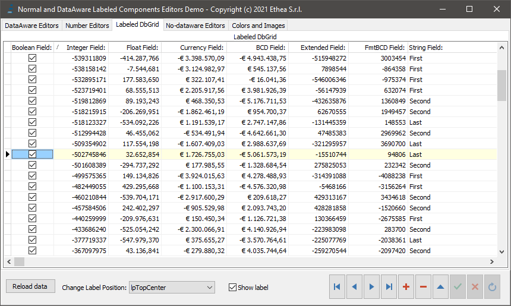
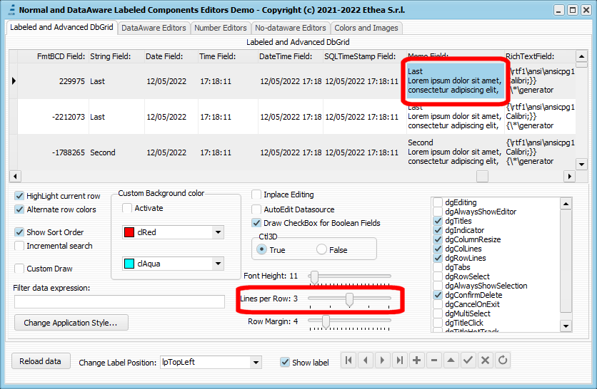
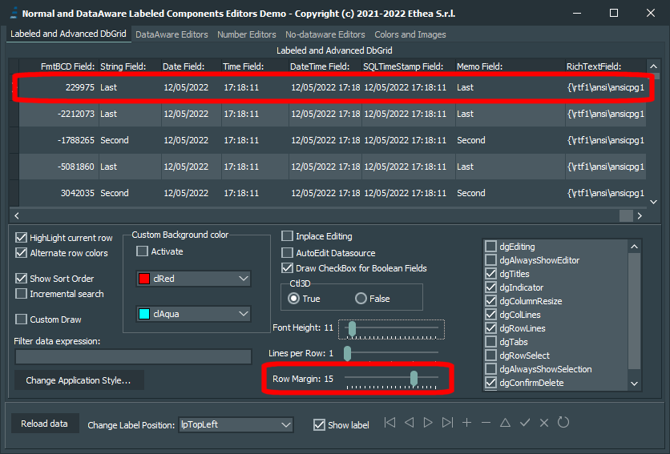
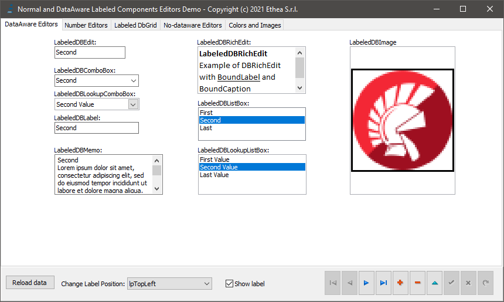
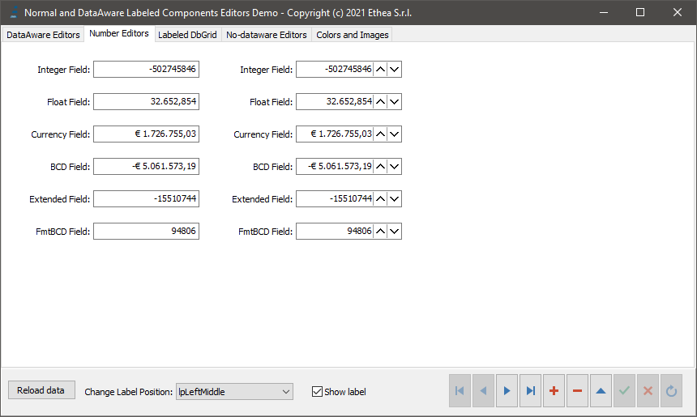
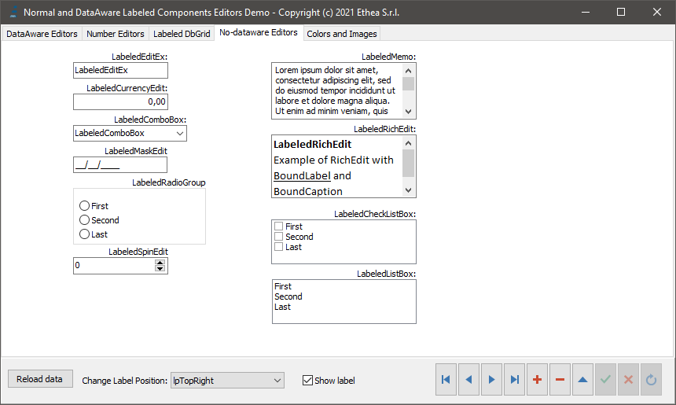
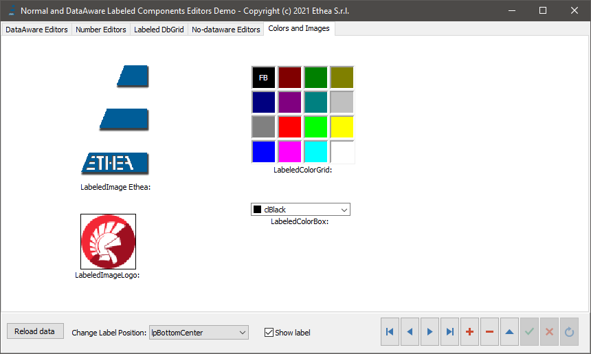
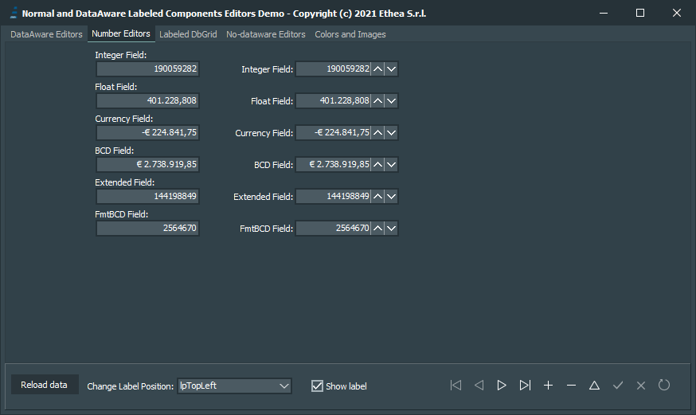
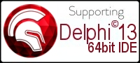

# DBAwareLabeledComponents 

An extended TDBGrid plus classic Delphi-VCL Editors with Boundary-Label (DB-Aware and Standard) including NumberBox

### Actual official version 1.2.2 (VCL)

An advanced TDbGrid component:

TLabeledDbGrid is an advanced version of classic TDbGrid with a boundary Label, plus some extra features:
- ShowSortOrder: shows an indicator of sorting column
- Embedeed CheckBox for boolean fields
- Incremental search, when typing into a ReadOnly DbGrid
- Alternate row-color
- Custom row-colors
- Show sort order
- Incremental search
- Lines per Rows (to show memo fields with multiple lines)
- RowMargin (to enlarge heigh of any row)

*Example of a TLabeledDbGrid (with some extended functionality like inplace checkbox and sorting) with the label aligned TopCenter (inside the client area of the grid aligned alClient).

This library contains also the classic VCL editors (standard and data-aware) with the addition of a "label" attached to the component itself (like the native component TLabeledEdit). 

It is no longer necessary to keep the Label "connected" and "aligned" by hand to the editor: on every component you can specify 3 simple properties:
- BoundCaption
- BoundLabel.Labelposition (default lpTopLeft)
- BoundLabel.LabelSpacing (default 1)

The label can be positioned with 12 alignements:
**lpTopLeft, lpTopCenter, lpTopRight, lpBottomLeft, lpBottomCenter, lpBottomRight, lpLeftTop, lpLeftMiddle, lpLeftBottom, lpRightTop, lpRightMiddle, lpRightBottom**

## TLabeledButtonEdit:

Also available for D10.3 to latest, TLabeledButtonEdit and TLabeledDBButtonEdit are a classic editors with a button inside (on the right). For Date Fields the button opens automatically a Popup-Calendar.

*Look at those examples, showing all the components with different Label alignments: the demo is available into Demo Folder*

| Sample | Description |
| ------ | ----------- |
|  | Example of LabeledDbGrid with LinesPerRow = 3 to show multiline content of memo fields |
|  | Example of LabeledDbGrid with RowMargin = 15 to to change height of grid Row. Fully compatible with Styles (light and dark)|
|  | Example of collection of Dataaware components with label aligned to "TopLeft" |
|  | Example of LabeledDBCurrencyEdit and LabeledDBNumberBox (only for 10.4.2): Dataware components for numeric input (from right to left) with label aligned to "LeftMiddle" |
|  | Example of collection of Standard components with label aligned to "TopRight" |
|  | Example of collection of components with label aligned to "BottomCenter" |
|  | All components are fully VCL styles compatible |

A complete Demo is available in Demo Folder.

## Support for new NumberBox component

**TNumberBox** component (available from D10.4.2) is the new component for advanced numeric input. In this library you can find:
- TDBNumberBox: the standard component with classic DataAeware support (DataSource + DataField) without Label.
- TLabeledNumberBox: a TNumberBox component with boudary label
- TLabeledDBNumberBox: a TDBNumberBox with boudary label

### Available from Delphi XE3 to Delphi 11 (32bit and 64bit platforms)

Related links: https://www.embarcadero.com/ - https://learndelphi.org/

## INSTALLATION

Clone repository, open Package Group "PackageGroup.groupproj" of your Delphi version located in: 

_DBAwareLabeledComponents\Packages\DXXX_

Build RunTime package: DBAwareLabeledComponents.dproj

Install DesignTime package: dclDBAwareLabeledComponents.dproj

**Remember to add those folders to Search Path:**

_{InstallDir}\Source_

### DOCUMENTATION

Coming soon, into Wiki section.

### RELEASE NOTES
05 Sep 2022: ver.1.2.2
- Refactoring of rendering TLabeledDBGrid to fix some problems when dgRowSelect is active

19 Aug 2022: ver.1.2.1
- Fixed checkbox drawing in "Windows" style, using rowmargin and/or LinesPerRow
- Fixed drawing cell right aligned
- Fixed Setting custom cursor for Grid

15 Jun 2022: ver.1.2.0
- Added TLabeledButtonEdit and TLabeledDBButtonEdit (from Delphi 10.1)
- Updated Demo with TLabeledButtonEdit and TLabeledDBButtonEdit examples
- Added Packages for Delphi 10.1 and Delphi XE8

17 May 2022: ver.1.1.0
- Added LinesPerRow and RowMargin to TLabeledDbGrid
- Updated Demo with full features of TLabeledDbGrid
- Changed LibSuffix for Packages (D10.4 and D11)
- Renamed Package Description to "Ethea: Dataaware Labeled Components"

10 Oct 2021:
- Fixed LabeledDbGrid for Rendering selected cell with Windows 11
- Fixex LabeledDbGrid columns draw in High-DPI app

03 Sep 2021:
- Added support for Delphi 11

25 Apr 2021: version 1.0.0

Components released:

only for D10.4.2 and above
- TDBNumberBox
- TLabeledNumberBox
- TLabeledDBNumberBox

only for D10.1 and above
- TLabeledDBButtonEdit
- TLabeledButtonEdit

for all Delphi versions (from XE3)
- TLabeledColorGrid
- TLabeledCurrencyEdit
- TLabeledDBCurrencyEdit
- TLabeledSpinEdit
- TLabeledRichEdit
- TLabeledCheckListBox
- TLabeledEditEx (similar to TLabeledEdit)
- TLabeledComboBox
- TLabeledListBox
- TLabeledMemo
- TLabeledDBEdit
- TLabeledDBLabel
- TLabeledDBComboBox
- TLabeledDBListBox
- TLabeledDBMemo
- TLabeledDBImage
- TLabeledDBLookupListBox
- TLabeledDBLookupComboBox
- TLabeledDbGrid
- TLabeledDBRichEdit
- TLabeledDBCtrlGrid
- TLabeledDBListView
- TLabeledMaskEdit
- TLabeledRadioGroup
- TLabeledImage
- TLabeledColorBox
 
