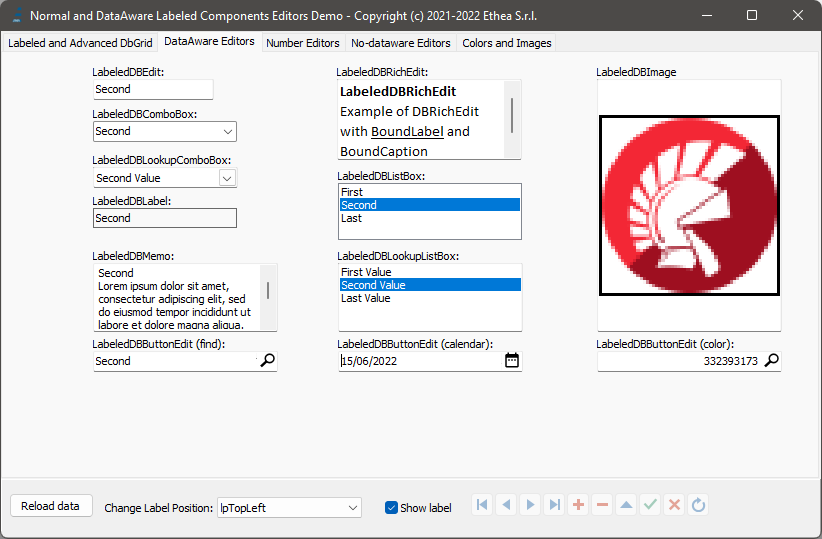
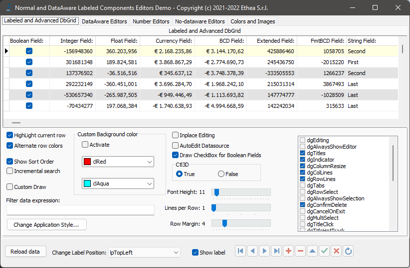
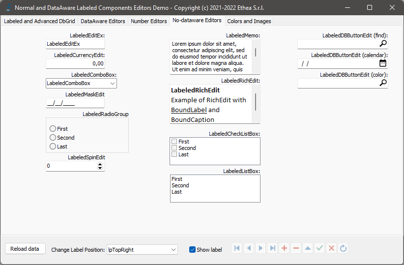
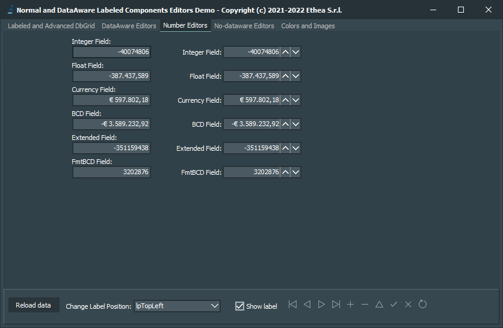

# DBAwareLabeledComponents 

Classic Delphi-VCL Editors plus a Boundary-Label (DB-Aware and Standard) including NumberBox, plus an Extended DbGrid

### Actual official version 1.0.0 (VCL)

With this small library of VCL components it is possible to have the classic VCL editors (standard and data-aware) with the addition of a "label" attached to the component itself (like the native component TLabeledEdit). 

It is no longer necessary to keep the Label "connected" and "aligned" by hand to the editor: on every component you can specify 3 simple properties:
- BoundCaption
- BoundLabel.Labelposition (default lpTopLeft)
- BoundCaption.LabelSpacing (default 1)

*Look at those examples, showing all the components with different Label alignments:*

| Sample | Description |
| ------ | ----------- |
|  | Example of collection of Dataaware components with label aligned to "TopLeft" |
|  | Example of LabeledDBCurrencyEdit and LabeledDBNumberBox (only for 10.4.2): Dataware components for numeric input (from right to left) with label aligned to "LeftMiddle" |
|  | Example of a DbGrid (with some extended functionality like inplace checkbox and sorting) with the label aligned TopCenter (notice that the grid is aligned alClient and the Label is rendered inside the client area) |
|  | Example of collection of Standard components with label aligned to "TopRight" |
|  | Example of collection of components with label aligned to "BottomCenter" |
|  | All components are fully VCL styles compatible |

## Support for new NumberBox component

**TNumberBox** component (available from D10.4.2) is the new component for advanced numeric input. In this library you can find:
- TDBNumberBox: the standard component with classic DataAeware support (DataSource + DataField) without Label.
- TLabeledNumberBox: a TNumberBox component with boudary label
- TLabeledDBNumberBox: a TDBNumberBox with boudary label

## An advanced TDbGrid component

TLabeledDbGrid is an advanced version of classic TDbGrid with the boundary Label, plus some extra features:
- ShowSortOrder: shows an indicator of sorting column
- Embedeed CheckBox for boolean fields
- Incremental search, when typing into a ReadOnly DbGrid
- Alternate row-color
- Custom row-colors

### Available from Delphi XE3 to Delphi 10.4 (32bit and 64bit platforms)

Related links: https://www.embarcadero.com/ - https://learndelphi.org/

## INSTALLATION

Clone repository, open Package Group "PackageGroup.groupproj" of your Delphi version located in: 

_DBAwareLabeledComponents\Packages\DXXX_

Build RunTime package: DBAwareLabeledComponents.dproj

Install DesignTime package: dclDBAwareLabeledComponents.dproj

**Remember to add those folders to Search Path:**

_{InstallDir}\Source_

### DOCUMENTATION

Coming soon, into Wiki section.

### RELEASE NOTES
25 Apr 2021: version 1.0.0

Components released:

only for D10.4.2
- TDBNumberBox
- TLabeledNumberBox
- TLabeledDBNumberBox

for all Delphi versions (from XE3)
- TLabeledColorGrid
- TLabeledCurrencyEdit
- TLabeledDBCurrencyEdit
- TLabeledSpinEdit
- TLabeledRichEdit
- TLabeledCheckListBox
- TLabeledEditEx
- TLabeledComboBox
- TLabeledListBox
- TLabeledMemo
- TLabeledDBEdit
- TLabeledDBLabel
- TLabeledDBComboBox
- TLabeledDBListBox
- TLabeledDBMemo
- TLabeledDBImage
- TLabeledDBLookupListBox
- TLabeledDBLookupComboBox
- TLabeledDbGrid
- TLabeledDBRichEdit
- TLabeledDBCtrlGrid
- TLabeledDBListView
- TLabeledMaskEdit
- TLabeledRadioGroup
- TLabeledImage
- TLabeledColorBox
 
